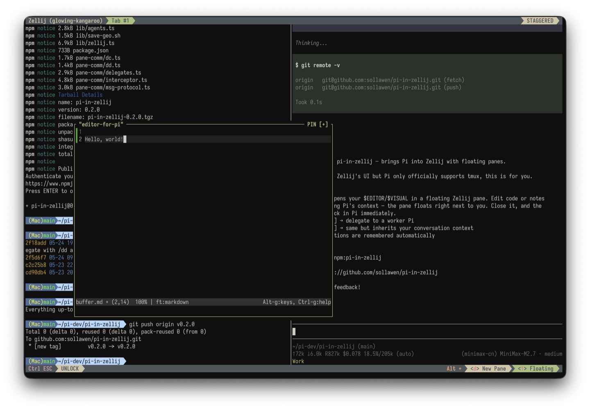

# pi-in-zellij


## Why?

**Pi only supports tmux out of the box.** But let's be honest — Zellij is just *gorgeous*. Floating panes, smooth UX, modern feel. Who is Tmux?

So I built this extension to bring Pi into Zellij, and things got a lot more interesting along the way.




## What can it do?

### 🖊️  Floating editor pane

Hit `alt+e` and a floating editor pane appears right in your terminal. Edit code or notes while keeping Pi's full context visible beside you. No more alt-tabbing to a separate editor. And, *you can move and resize this floating pane anywhere*. No more losing your train of thought.

Close the pane when you're done — your edits come right back into Pi's input. It's just *nice*.

---

### 🔄 Two Pies are better than one

This is the real deal. Pi spawns *another Pi* in a floating pane, and they talk to each other over a tiny protocol.

- `/dd [agentName] <task>`: **D**irect **D**elegate — skip the prompt-polishing, send the task straight to the Worker
- `/dc [agentName] <task>`: **D**elegate with **C**ontext — same as `/dd` but the Worker inherits your full conversation context 


**Main-Pi thinks, Worker-Pi do.**

- **Main-Pi** runs the expensive, smart model — it thinks, plans, and coordinates
- **Worker-Pi** run cheaper models — searching code, writing boilerplate, reviewing PRs, checking types
- **No context pollution** — Worker-Pi runs in his own pane, main-Pi stays clean
- **Full visibility** — every Pi output streams in front of you. Interrupt if needed.


**Agents ready.** 

If you have custom agents (defined in `.pi/agents/`), you can assign them to the Worker: `/dd code-reviewer "review this PR"`

For more on agents and delegation, see [PI-AGENTS.md](./docs/PI-AGENTS.md).

---

> `/dc` is same as `/dd` but the Worker inherits your full conversation context via `pi --fork`. Use it when the discussion content matters for the Worker's task. For most tasks, `/dd` (no context) is the better default — faster and cheaper.

### 💾 Geometry memory

Pi remembers where you like your floating panes. Close a pane, open it again later — it comes back exactly where you left it. Pane positions are saved per-pane-type (editor vs. worker), stored in `~/.pi/tmp/zellij-geometry`.

---

## Quick start

```bash
pi install npm:pi-in-zellij
```

That's it. Restart Pi and you're ready.


## Configuration

Want to customize? Create `.pi/pi-in-zellij/config.json` in your project root. Any field you set overrides the default — the rest stays as-is.

**Example — use a cheap model for the Worker:**

```json
{
  "models": "google/gemini-2.5-flash",
  "mode": "work"
}
```

## Requirements

- [Zellij](https://zellij.dev) — you're using it, right?
- [Pi](https://pi.dev) — obviously
- A terminal that supports floating panes (Zellij does by default)

---

### Sollawen

email: sollawen@163.com
